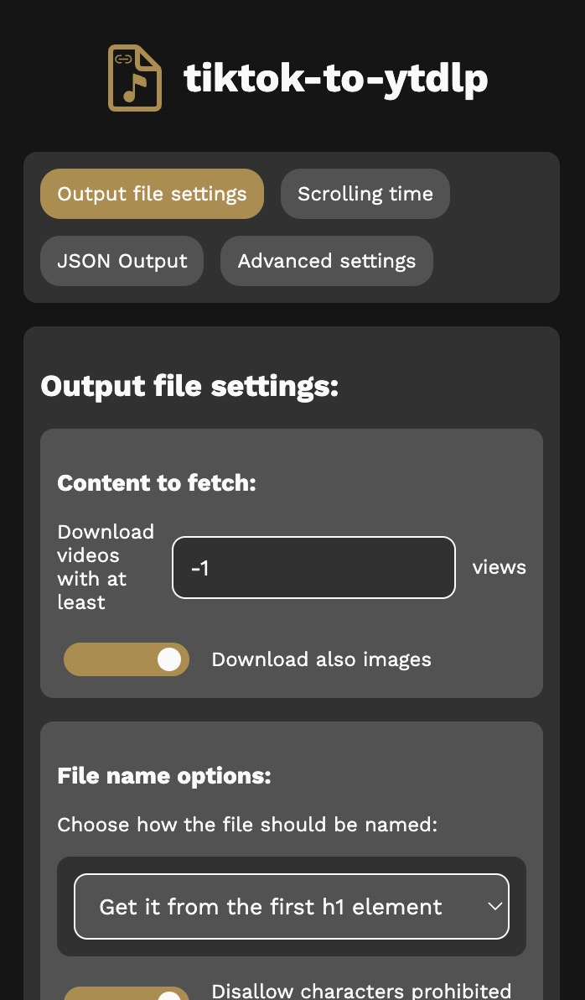

# Browser extension

Hello there! Here you can find the source code of the tiktok-to-ytdlp extension.
By installing it, you can use this script from a graphical UI, without needing
to paste anything in the console.

This makes also possible using tiktok-to-ytdlp on mobile browsers, especially on
Firefox for Android. If you're on iOS, look for an extension similar to
TamperMonkey for Safari.

## Installation guide

**Using Firefox? Download it from the
[Mozilla Addons Store](https://addons.mozilla.org/it/firefox/addon/tiktok-to-ytdlp/)**

While you can build the extension yourself, I recommend you to download the
built zip file
[from GitHub Releases](https://github.com/Dinoosauro/tiktok-to-ytdlp/releases/latest).
If you still want to build it, look at the instructions below.

### Chromium

If you still have a Chromium-based browser

1. ~~Switch to Firefox~~ Unzip the extension file
2. Go to the `chrome://extensions` page, and enable the `Developer mode` slider
3. Click on `Load unpacked extension`, and then choose the folder where you've
   unzipped the file.
4. You can now use tiktok-to-ytdlp. You should find it in the extension tray (or
   on the dropdown menu that appears after clicking the extension icon)

### Firefox

You can simple install it from the Mozilla Addons link above.

1. Go to `about:debugging#/runtime/this-firefox`
2. Click on `Load Temporary Add-on`
3. Choose the .zip file
4. The extension is installed!

## Building guide

You'll need a recent version of Node.js for building it. First, clone **the
entire repository**. Open it in the terminal, and go to the `extension`
directory (`cd extension`). Now install the dependencies for the build script
(`npm i`), and finally run the script (`node build.js`).

You'll find two new things:

- A folder, `output`, with everything needed by the extension
- A zip file, `output.zip`, that you can use for sideloading it on Firefox.

## The UI

At the top, you can switch between three sections, so that you can edit all the
settings of tiktok-to-ytdlp.

Then, at the bottom, you can start the conversion.

While the script fetches the videos, you can also obtain a partial .txt file of
the link obtained up to that time.

## Issues

If you have any issues with the building process, or in general with the
extension or the script, feel free to open an issue here on GitHub.
